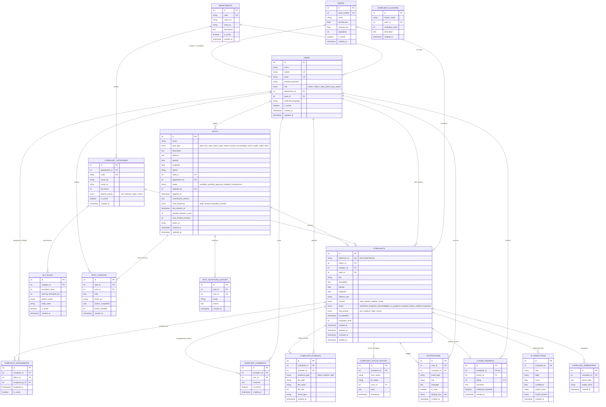

# Entity Relationship (ER) Diagram - AI-GovInsight

The database model is architected in PostgreSQL for high performance, ACID transactional safety, and strict multi-tenant / department scoping.

```mermaid
erDiagram
    DEPARTMENTS ||--o{ USERS : "has staff"
    DEPARTMENTS ||--o{ COMPLAINT_CATEGORIES : "defines"
    WARDS ||--o{ USERS : "resides in / assigned"
    WARDS ||--o{ COMPLAINTS : "located in"
    
    USERS ||--o{ COMPLAINTS : "files (citizen)"
    USERS ||--o{ COMPLAINT_ASSIGNMENTS : "assigned to (officer)"
    USERS ||--o{ COMPLAINT_COMMENTS : "posts"
    USERS ||--o{ COMPLAINT_EVIDENCE : "uploads"
    USERS ||--o{ NOTIFICATIONS : "receives"
    USERS ||--o{ CITIZEN_FEEDBACK : "submits"

    COMPLAINT_CATEGORIES ||--o{ COMPLAINTS : "categorizes"
    COMPLAINT_CATEGORIES ||--o{ SLA_RULES : "governed by"

    COMPLAINTS ||--o{ COMPLAINT_ASSIGNMENTS : "assigned via"
    COMPLAINTS ||--o{ COMPLAINT_STATUS_HISTORY : "tracks transitions"
    COMPLAINTS ||--o{ COMPLAINT_COMMENTS : "threaded discussions"
    COMPLAINTS ||--o{ COMPLAINT_EVIDENCE : "media records"
    COMPLAINTS ||--o| CITIZEN_FEEDBACK : "rated by citizen"
    COMPLAINTS ||--o{ NOTIFICATIONS : "triggers"
    COMPLAINTS ||--o{ AI_PREDICTIONS : "inspected by AI"
    COMPLAINTS ||--o{ COMPLAINT_EMBEDDINGS : "vectorized"
    SPOTS ||--o{ COMPLAINTS : "linked to"
    USERS ||--o{ SPOTS : "adopts"
    SPOTS ||--o{ SPOT_CHECKINS : "has check-ins"
    USERS ||--o{ SPOT_CHECKINS : "submits"
    SPOTS ||--o{ SPOT_ADOPTIONS_HISTORY : "audit trail"

    DEPARTMENTS {
        int id PK
        string code UK
        string name_en
        string name_ta
        text description
        boolean is_active
        timestamp created_at
    }

    WARDS {
        int id PK
        int ward_number UK
        string name
        float centroid_lat
        float centroid_lng
        int population
        boolean is_active
        timestamp created_at
    }

    USERS {
        int id PK
        string name
        string mobile UK
        string email UK
        string hashed_password
        enum role "citizen | officer | dept_admin | gov_admin"
        int department_id FK
        int ward_id FK
        string preferred_language
        boolean is_active
        timestamp created_at
        timestamp updated_at
    }

    COMPLAINT_CATEGORIES {
        int id PK
        int department_id FK
        string code UK
        string name_en
        string name_ta
        int sla_hours
        enum default_priority "low | medium | high | critical"
        boolean is_active
        timestamp created_at
    }

    COMPLAINTS {
        int id PK
        string reference_no UK "GOV-2026-000123"
        int citizen_id FK
        int category_id FK
        int ward_id FK
        string title
        text description
        float latitude
        float longitude
        string address_text
        enum channel "web | mobile | helpline | email"
        enum status "submitted | assigned | acknowledged | in_progress | resolved | citizen_verified | reopened"
        enum final_priority "low | medium | high | critical"
        timestamp sla_deadline
        int escalation_level
        timestamp created_at
        timestamp updated_at
        timestamp resolved_at
        timestamp verified_at
    }

    COMPLAINT_ASSIGNMENTS {
        int id PK
        int complaint_id FK
        int officer_id FK
        int assigned_by_id FK
        timestamp assigned_at
        boolean is_active
    }

    COMPLAINT_STATUS_HISTORY {
        int id PK
        int complaint_id FK
        string from_status
        string to_status
        int actor_id FK
        text note
        timestamp timestamp
    }

    COMPLAINT_COMMENTS {
        int id PK
        int complaint_id FK
        int user_id FK
        text comment
        boolean is_internal
        timestamp created_at
    }

    COMPLAINT_EVIDENCE {
        int id PK
        int complaint_id FK
        int uploader_id FK
        enum evidence_type "citizen | before | after"
        string file_path
        string file_name
        int file_size
        string mime_type
        timestamp created_at
    }

    CITIZEN_FEEDBACK {
        int id PK
        int complaint_id FK,UK
        int citizen_id FK
        int rating "1-5"
        text comment
        boolean confirmed_resolved
        timestamp created_at
    }

    SLA_RULES {
        int id PK
        int category_id FK
        int escalation_level
        int warning_threshold_pct
        string breach_action
        string notify_roles
        boolean is_active
        timestamp created_at
    }

    NOTIFICATIONS {
        int id PK
        int user_id FK
        int complaint_id FK
        string event_type
        string title
        text message
        boolean is_read
        string dedupe_key UK
        timestamp created_at
    }

    AI_PREDICTIONS {
        int id PK
        int complaint_id FK
        string task
        string label
        float score
        float confidence
        string model_name
        string model_version
        timestamp created_at
    }

    COMPLAINT_EMBEDDINGS {
        int id PK
        int complaint_id FK
        text vector_data
        string model_name
        timestamp created_at
    }

    COMPLAINT_CLUSTERS {
        int id PK
        string cluster_name
        int ward_id FK
        int complaint_count
        text description
        timestamp created_at
    }

    SPOTS {
        int id PK
        string name
        enum spot_type "park | bus_stop | water_body | street | school_surroundings | drain | public_toilet | other"
        text description
        text address
        float latitude
        float longitude
        string district
        int ward_id FK
        int department_id FK
        enum status "available | pending_approval | adopted | maintenance"
        int adopted_by FK
        timestamp adopted_at
        json commitment_actions
        enum care_frequency "daily | weekly | biweekly | monthly"
        timestamp last_checkin_at
        int missed_checkins_count
        int max_missed_checkins
        string photo_url
        timestamp created_at
        timestamp updated_at
    }

    SPOT_CHECKINS {
        int id PK
        int spot_id FK
        int user_id FK
        text note
        string photo_url
        json actions_completed
        int points_awarded
        timestamp created_at
    }

    SPOT_ADOPTIONS_HISTORY {
        int id PK
        int spot_id FK
        int user_id FK
        string action
        text reason
        timestamp created_at
    }
```
